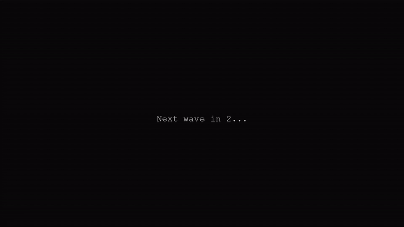

## Description

Endless Console-Style Pygame is a minimalist game developed using Pygame. The objective is to achieve the highest score possible by avoiding obstacles and collecting bonuses in an infinite gameplay environment.

## Controls

- **Mouse:** The character follows your mouse.
- **Esc:** Pause the game.
- **Enter:** Menu action.

## Gameplay

## License

This project is licensed under the MIT License. See the [LICENSE](LICENSE) file for more details.
